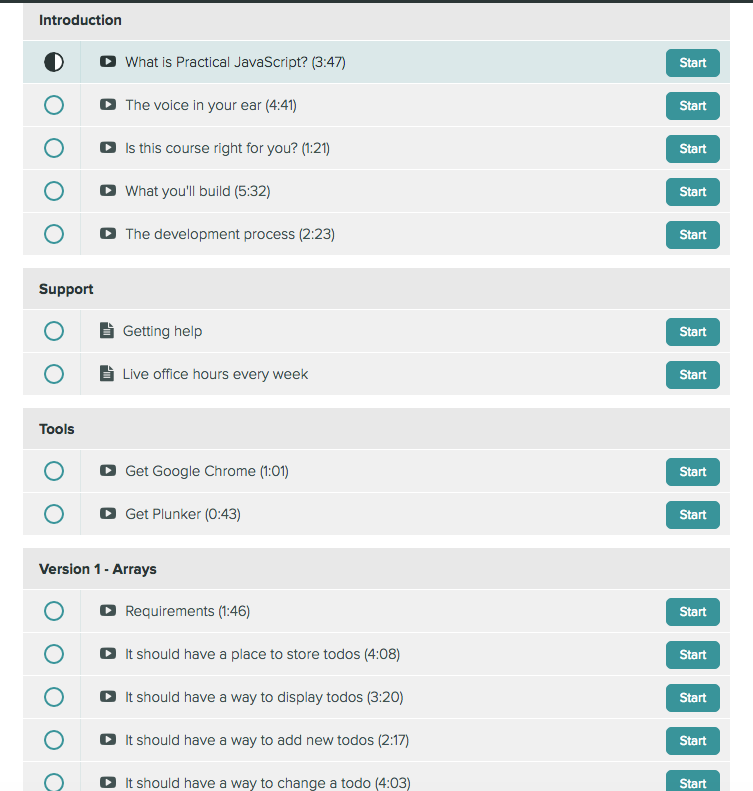

Title: Code Challenge Pilot - calculate total time JS course
Date: 2017-01-04 20:01
Category: Challenges
Tags: codechallenges, learning, python, beginners, code
Slug: js_time_scraper_ch
Authors: Julian
Summary: Coding Challenge to create a web scraper that calculates the total time of a Javascript Course.
cover: images/featured/pb-article.png

Bob and I thought it'd be interesting to do some code challenges. That is, Bob specifies the challenge and I complete it. Bob then goes through my code and makes any necessary edits/improvements to make it more Pythonic.

This will not only improve my Python and his code review skills but should also (hopefully!) provide you with something interesting or at least entertaining, to read.

Feel free to give any feedback or improvements of your own in the comments below!

## The Challenge

Bob discovered a free, online [Javascript Course](https://watchandcode.com/courses/enrolled/practical-javascript) that he felt would be useful to us. On creating an account you're faced with the below course content list.

The problem is that while each module/video displays its own duration, there's no course total time listed anywhere.

Enter the Challenge: Create a web scraper that parses the page and then calculates the total course time.

(*My* final code can be located [here](https://github.com/pybites/blog_code/blob/1f4dc534d43ec2c8582a890a15fb54486b58af39/katas/course_time/js_course_time_scraper.py)). Update: our code review is [here](http://pybit.es/challenge_pilot_codereview.html).

## Limitations and Complications

1. The main content page is behind a login. How the heck was I supposed to automate a scraper to log into the site with my creds and then pull the page?

2. I manually right-clicked and selected 'Save As' (on Windows) to save the page as an html file but when I tried to parse the file with BeautifulSoup I consistently hit an error.

## The Setup

I initially wanted to use BeautifulSoup for this but as I kept hitting the aforementioned error and was running out of time (sleep!) I decided to keep it simple, albeit a little manual.

- I highlighted the entire page and saved it as plain text into a file titled "content.html".

- The program is to be created in the same directory as the content.html file.

## Key Moments and Challenges

- The program could have easily been a single, huge block of code but I decided it was best to split each 'job' into a different function. There are 2 functions in total:

~~~~
#Read in the HTML file and search it using my time regex
def search_file(file)
~~~~

~~~~
#Strip out the brackets and the colon to calculate the mins and seconds
def time_calculation(durations)
~~~~

- Creating the time search regex. This was the real challenge for me! While I'd used regex before it was definitely a challenge to search for a time string. The complexity was in coding the regex to search for both single minutes and double digit minutes, eg: 7:43 and 10:43. (As the times are all within ()s on the page, it was easier to include the braces in the regex):

~~~~
time_regex = re.compile(r'\(\d+:\d+\)') #Creating the regex
~~~~

- Stripping away the unecessary bits so I could work with the raw numbers. I used the strip() and split() methods for this. Admittedly, I was stoked when I realised I could use them both in one line of code (it's the small wins). This was done within a for loop to iterate over the list created by the regex search:

~~~~
#For loop to strip brackets/colon and assign the mins/seconds
for i in range(len(durations)):
    minutes, seconds = durations[i].strip('()').split(':')
~~~~

## Result

The program eventually worked! I was able to calculate that the course took roughly 6.8hrs to complete.

## Thoughts and Changes

- I was bummed I didn't actually get the traditional web scrape working at the time. I would like to figure out where I went wrong with that so I can use BeautifulSoup to properly scrape the content.html file. (I'd already found the css I needed to search damnit!)

- There are 30 lines of code in this program. I believe there are lines that can be refactored to do multiple assignments and calculations on a single line. Eg: The for loop that strips the brackets and colon also adds the mins and seconds - I'm sure it can be improved.

## Conclusion and Next Step

As annoyed as I got at certain points, I actually enjoyed this. Problem wise it's as simple as they come but it forced me to revisit the basics of regex and string manipulation.

As I write this I'm getting github commit notifications of Bob refactoring and commenting so I know he's hard at work making my code as Pythonic as possible.
Tomorrow's post will be his feedback... go easy on me brother!

(Again, find *my* code for this challenge [here](https://github.com/pybites/blog_code/blob/1f4dc534d43ec2c8582a890a15fb54486b58af39/katas/course_time/js_course_time_scraper.py). Update: our code review is [here](http://pybit.es/challenge_pilot_codereview.html)).

Keep Calm and Code in Python!

-- Julian
